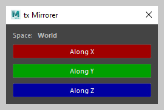
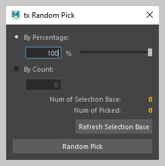
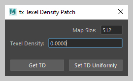
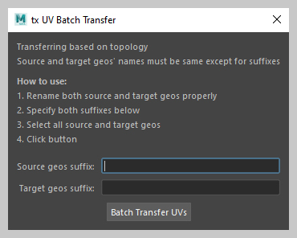

# txmaya


__txmaya__ is a collection of maya tools to help artists to enhance their productivity. Still keep updating.


## Installation

1. Copy the entire `txmaya` folder (Second `txmaya` folder under repo's root) to your maya's `$MAYA_APP_DIR`:

    - Windows: `\Users\<username>\Documents\maya\<version>\scripts`
    - Linux:    `$HOME/maya/<version>/scripts`
    - Mac OS X: `$HOME/Library/Preferences/Autodesk/maya/<version>/scripts`

    or any one of your `$PYTHONPATH`.

2. Run the codes below in maya's script editor to show each tool's UI.

## Tools

- ### General
    
    -  #### tx File Buffer
        
        A tool allows users to export selection to a temporary folder and re-import back. Could be used for sending files in-between different mayas or cleaning up geometries.
        
        
                
        ```python
        from txmaya.general.file_buffer import FileBuffer
        FileBuffer.run()
        ```
    
- ### Modeling
    
    - #### tx Mirrorer
    
        A world-space mirroring tool to mirror multiple geos and their UVs without losing transformations:
    
        
        
        ```python
        from txmaya.modeling.mirrorer import Mirrorer
        Mirrorer.run()
        ```
           
    - #### tx Random Pick
        
        A tool to randomly select some members from a group of items:
    
        
    
        ```python
        from txmaya.modeling.random_pick import RandomPick
        RandomPick.run()
        ```

    - #### tx Texel Density Patch
    
        A tool to get selections' UV texel density and scale other selections' UV __*altogether*__ based on the td value:
    
        
    
        ```python
        from txmaya.modeling.texel_density_patch import TexelDensityPatch
        TexelDensityPatch.run()
        ```
    
    - #### tx UV Batch Transfer
        
        A tool to transfer UVs in-between two groups of geos with 1 click. (Based on topology)
        
        
        
        ```python
        from txmaya.modeling.uv_batch_transfer import UvBatchTransfer
        UvBatchTransfer.run()
        ```
    


