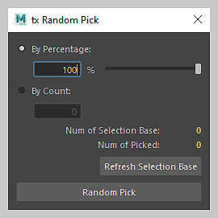

# txmaya

Maya tools collection. Still continue updating.

## tx Random Pick
```python
from txmaya.modeling.random_pick import RandomPick
RandomPick.run()
```

## tx File Buffer
```python
from txmaya.general.file_buffer import FileBuffer
FileBuffer.run()
```

## tx Mirrorer
```python
from txmaya.modeling.mirrorer import Mirrorer
Mirrorer.run()
```


## tx Uv Batch Transfer
```python
from txmaya.modeling.uv_batch_transfer import UvBatchTransfer
UvBatchTransfer.run()
```

## tx Texel Density Patch

```python
from txmaya.modeling.texel_density_patch import TexelDensityPatch
TexelDensityPatch.run()
```

